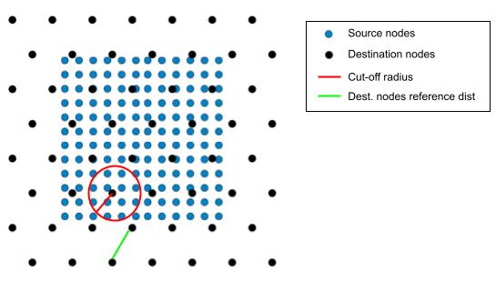

.. _cutoff_radius:

################
 Cut-off radius
################

The *cut-off method* is a method for establishing connections between
two sets of nodes. Given two sets of nodes, (`source`, `target`), the
cut-off method connects all source nodes, :math:`V_{source}`, in a
neighbourhood of the target nodes, :math:`V_{target}`.

The neighbourhood is defined by a `cut-off radius`, which is computed
as,

.. math::

   \text{cutoff_radius} = \text{cutoff_factor} \times \text{nodes_reference_dist}

where :math:`\text{nodes_reference_dist}` is the maximum distance
between a target node and its nearest source node.

.. math::

   \text{nodes_reference_dist} = \max_{x \in V_{target}} \left\{  \min_{y \in V_{source}, y \neq x} \left\{ d(x, y) \right\} \right\}

where :math:`d(x, y)` is the `Haversine distance
<https://en.wikipedia.org/wiki/Haversine_formula>`_ between nodes
:math:`x` and :math:`y`. The :math:`\text{cutoff_factor}` is a parameter
that can be adjusted to increase or decrease the size of the
neighbourhood, and consequently the number of connections in the graph.

To use this method to create your connections, you can use the following
YAML configuration:

.. code:: yaml

   edges:
      -  source_name: source
         target_name: destination
         edge_builders:
         -  _target_: anemoi.graphs.edges.CutOffEdges
            cutoff_factor: 0.6

.. note::

   The cut-off method is recommended for the encoder edge, to connect
   all data nodes to hidden nodes. The optimal ``cutoff_factor`` value
   will be the lowest value without orphan nodes. This optimal value
   depends on the node distribution, so it is recommended to tune it for
   each case.
