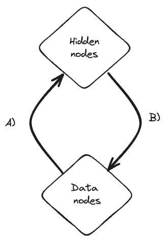

.. _usage-getting-started:

#################
 Getting started
#################

The simplest use case is to build an encoder-processor-decoder graph for
a global weather model.

**************
 First recipe
**************

In this case, the recipe must contain a ``nodes`` section where the keys
will be the names of the sets of `nodes`, that will later be used to
build the connections. Each `nodes` configuration must include a
``node_builder`` section describing how to generate the `nodes`, and it
may include an optional ``attributes`` section to define additional
attributes (weights, mask, ...).

.. literalinclude:: yaml/nodes.yaml
   :language: yaml

Once the `nodes` have been defined, you need to create the edges between
them through which information will flow. To this aim, the recipe file
must contain a ``edges`` section. These connections are defined between
pairs of `nodes` (source and target, specified by `source_name` and
`target_name`).

There are several methods to build these edges such as cutoff
(`CutOffEdges`) or nearest neighbours (`KNNEdges`). For an
encoder-processor-decoder graph you will need to build two sets of
`edges`. The first set of edges will connect the `data` nodes with the
`hidden` nodes to encode the input data into the latent space, normally
referred to as the `encoder edges` and represented here by the first
element of the ``edges`` section. The second set of `edges` will connect
the `hidden` nodes with the `data` nodes to decode the latent space into
the output data, normally referred to as `decoder edges` and represented
here by the second element of the ``edges`` section.

.. literalinclude:: yaml/global_wo-proc.yaml
   :language: yaml

To create the graph, run the following command:

.. code:: console

   $ anemoi-graphs create recipe.yaml graph.pt

Once the build is complete, you can inspect the dataset using the
following command:

.. code:: console

   $ anemoi-graphs inspect graph.pt

This will generate the following graph:

.. literalinclude:: yaml/global_wo-proc.txt
   :language: console

.. note::

   Note that that the resulting graph will only work with a Transformer
   processor because there are no connections between the `hidden
   nodes`. This is the default behaviour for :ref:`anemoi-training
   <anemoi-training:index-page>`.

******************************
 Adding processor connections
******************************

To add connections within the ``hidden`` nodes, to be used in the
processor, you need to add a new set of `edges` to the recipe file.
These connections are normally referred to as `processor edges` and are
represented here by the third element of the ``edges`` section.

.. literalinclude:: yaml/global.yaml
   :language: yaml

This will generate the following graph:

.. literalinclude:: yaml/global.txt
   :language: console

*******************
 Adding attributes
*******************

When training a data-driven weather model, it is common to add
attributes to the nodes or edges. For example, you may want to add node
attributes to weight the loss function, or add edge attributes to
represent the direction of the edges.

To add attributes to the `nodes`, you must include the `attributes`
section in the `nodes` configuration. The attributes can be defined as a
list of dictionaries, where each dictionary contains the name of the
attribute and the type of the attribute.

.. literalinclude:: yaml/nodes_with-attrs.yaml
   :language: yaml

To add the extra features to the edges of the graph, you need to set
them in the ``attributes`` section.

.. literalinclude:: yaml/global_with-attrs.yaml
   :language: yaml

This will generate the following graph:

.. literalinclude:: yaml/global_with-attrs.txt
   :language: console
